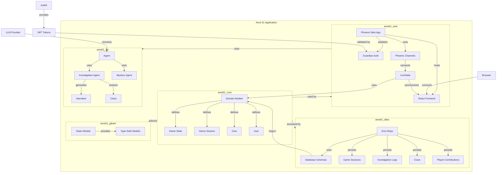

# 👽 Area 51: Unveiling the Unknown 🕵️‍♀️

Welcome to **Area 51: Unveiling the Unknown**, a real-time collaborative investigation game powered by Elixir, Phoenix, React, and Large Language Models (LLMs)! 🚀 Dive into the mysteries of Area 51, work with fellow investigators, and unravel the secrets hidden within this enigmatic location.

## 🎮 The Game

In **Area 51: Unveiling the Unknown**, you and your team of investigators are tasked with uncovering the truth behind the legendary Area 51. 🕵️‍♂️ Collaborate in real-time, share your findings, and let the LLM-powered game master guide your investigation.

### How to Play

1.  **Join an Investigation:** Start a new investigation or join an existing one.
2.  **Collaborate:** Share your observations, theories, and actions with your team.
3.  **Interact with the LLM:** The game master, powered by an LLM, will dynamically respond to your inputs, evolving the narrative in real-time.
4.  **Uncover Clues:** Discover hidden clues and piece together the puzzle.
5.  **Solve the Mystery:** Work together to uncover the truth behind Area 51!

## 🛠️ Tech Stack

-   **Elixir & Phoenix:** Robust and scalable backend for real-time communication and application logic. ⚡
-   **React:** Dynamic and responsive frontend for an engaging user experience. ⚛️
-   **Phoenix Channels:** Real-time communication via WebSockets. 📡
-   **LiveState:** Efficient state synchronization between the backend and frontend. 🔄
-   **Ecto & SQLite:** Data persistence for game sessions, clues, and logs. 💾
-   **Magus Library:** Seamless integration with Large Language Models. 🧠
-   **Gleam:** Type-safe functional programming for state modeling. 🌟

## 🧮 Architecture & Design
See the [deep search analysis](./Architecture_Deep_Search.md) a for detailed exploration.

## System Architecture Overview



### Modularity and Separation of Concerns

The Area 51 project is structured as a single Elixir application, promoting clear separation of concerns through its modular design using namespaces under the main `Area51` module:

-   **Area51.Core:** Contains the domain models and core game logic (formerly the `area51_core` app).
-   **Area51.Data:** Handles data persistence using Ecto (formerly the `area51_data` app).
-   **Area51.Llm:** Encapsulates LLM integration logic (formerly the `area51_llm` app).
-   **Area51.Web:** Manages HTTP and WebSocket interfaces (formerly the `area51_web` app).
-   **Area51.Gleam:** Leverages Gleam for type-safe state modeling (formerly the `area51_gleam` app).

This modular approach using namespaces within a single application facilitates testing, allows components to evolve with clarity, and supports system scalability.

### State Management

The application implements a sophisticated state management strategy:

-   **Backend State:** Game state is maintained in the Elixir backend, using Phoenix PubSub for real-time updates
-   **Frontend Synchronization:** LiveState library efficiently syncs backend state to the React frontend
-   **Event-Based Architecture:** State changes are driven by events, with the system responding to player actions and LLM outputs
-   **Type-Safe State Modeling:** Gleam provides compile-time type safety for state definitions

State flows from the backend to the frontend through Phoenix Channels and LiveState, creating a consistent, real-time experience for all players in an investigation.

### Authentication & Authorization

Authentication and authorization are implemented using industry-standard patterns:

-   **IDP-Based Authentication:** Integration with Auth0 provides secure authentication services
-   **JWT-Based Authorization:** JSON Web Tokens handle authorization for protected resources
-   **ETS Caching:** Erlang Term Storage provides fast, lightweight caching of validation keys
-   **JWKS Integration:** Dynamic key fetching with ETS caching enables seamless key rotation support

The system validates JWTs using cached JWKS (JSON Web Key Sets), providing robust security with minimal performance overhead.

### Observability

Comprehensive observability is achieved through multi-layered instrumentation:

-   **Telemetry:** Erlang/Elixir's telemetry library provides structured event emission
-   **OpenTelemetry:** Standardized tracing across service boundaries
-   **Structured Logging:** Consistent log formatting with contextual metadata
-   **Metrics Collection:** PromEx integration for Prometheus-compatible metrics
-   **Grafana Dashboards:** Pre-configured visualization for system performance

Traces follow requests through the system, from HTTP requests through channel operations to LLM interactions, providing end-to-end visibility into system behavior.

### Language Interoperability

The project showcases seamless interoperation between multiple programming languages:

-   **Elixir:** Powers the core application logic and backend services
-   **Gleam:** Provides type-safe state modeling with compile-time guarantees
-   **TypeScript:** Ensures type safety in the React frontend
-   **JavaScript:** Supports the React component ecosystem

This polyglot approach leverages each language's strengths while maintaining clean integration points.

## 🚀 Setup

1.  **Prerequisites:**

    You can install all the dependencies using [Nix](https://nixos.org/download/). Use the following command to enter the development shell:
    ```bash
    nix develop
    ```

2.  **Install Elixir and NPM Dependencies:**
    ```bash
    mix setup
    ```

3.  **Configure Auth0 environment and OpenAI key:**

    Create a new Auth0 dev environment with SPA application type and callback `http://localhost:4000`. Make a copy of the `.env.example` file into `.env` and update the envars
    according the values defined into your Auth0 environment.

    Also include your OpenAI key in the `.env`, unless it's already part of your shell environment.

4.  **Start the observability system:**
    ```bash
    docker-compose -f docker-compose.observability.yml up -d
    ```

5.  **Start the Area51 application:**
    ```bash
    mix phx.server
    ```

6.  **Access the Game:**
    -   Open your web browser and navigate to `http://localhost:4000`.

## 📂 Project Structure

```
area51_investigation/
├── assets/                # Frontend assets (React, JavaScript, CSS)
├── config/                # Application configurations
├── lib/                   # Elixir application code
│   └── area51/
│       ├── core/          # Core game logic
│       ├── data/          # Data persistence
│       ├── gleam/         # Gleam integration
│       ├── llm/           # LLM integration
│       └── web/           # Phoenix web components (controllers, channels, etc.)
├── priv/                  # Private application data
│   ├── gettext/           # Localization files
│   ├── repo/              # Ecto migrations and seeds
│   └── static/            # Static assets (favicon, robots.txt, compiled JS/CSS in assets/)
├── test/                  # Test files
│   └── area51/
│       ├── core/
│       ├── data/
│       ├── gleam/
│       ├── llm/
│       └── web/
├── gleam_state/           # Gleam package for state modeling
├── mix.exs                # Project configuration
└── README.md              # Project documentation
```

**Note:** The Mermaid diagram above reflects the old umbrella structure and needs to be manually updated to represent the current single-application architecture with namespaced modules.

## 🧠 LLM Integration

The `Area51.Llm` module handles the integration with the Large Language Model using the Magus library. 🚀

-   **Prompt Engineering:** Carefully crafted prompts guide the LLM to generate narrative elements, clues, and responses that fit the Area 51 theme. 📝
-   **Structured Output:** The LLM's responses are formatted into structured JSON to facilitate seamless integration with the backend. 📦
-   **Asynchronous Processing:** LLM interactions are handled asynchronously to maintain application responsiveness. ⏳

**Note:** You'll need to replace the placeholder in `lib/area51/llm/agent.ex` with your actual Magus library code and LLM provider credentials. 🔑

## Deployment

Build a release image with:
```bash
docker load < $(nix build .\#packages.aarch64-linux.image.area51.arm64 --no-link --print-out-paths)
docker run -e OPENAI_API_KEY=$OPENAI_API_KEY -p 4000:4000 -v area51db:/data area51:dirty
```

## 🤝 Contributing

We welcome contributions! Feel free to submit pull requests or open issues to improve the game. 🛠️

## 📜 License

This project is licensed under the [MIT License](LICENSE). 📄

---

Uncover the secrets of Area 51 and join the investigation! 🕵️‍♂️👽🚀
