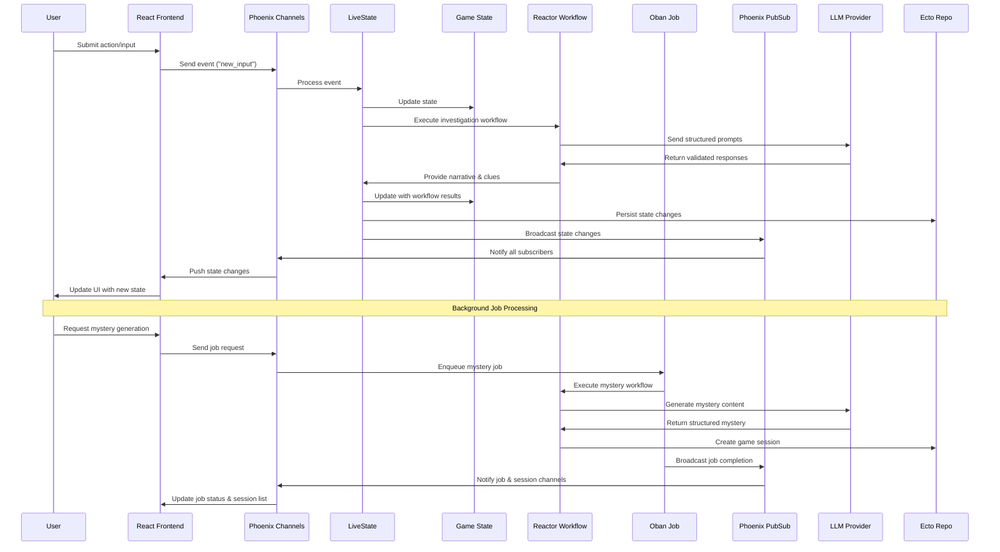
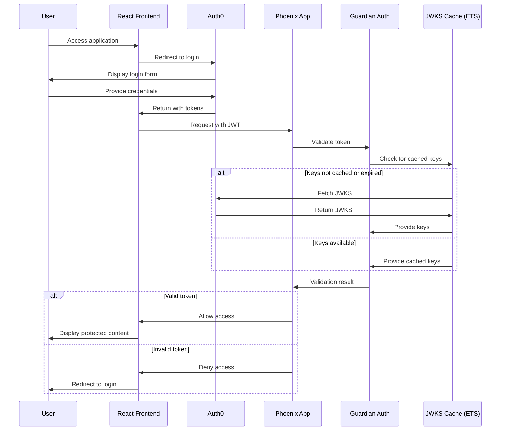
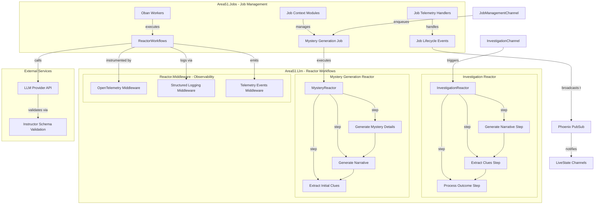
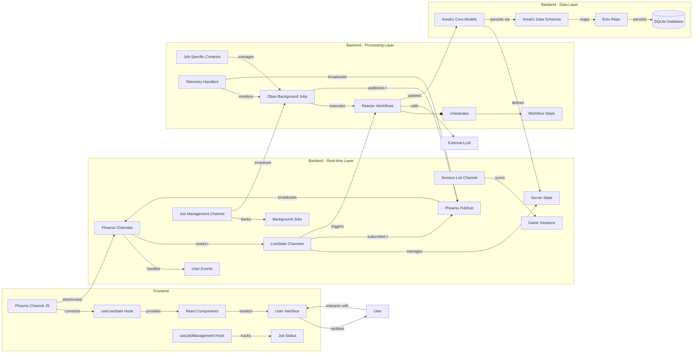

# Area 51 Architecture Diagrams

This document provides visual representations of the current Area 51 architecture, focusing on the updated job management system, Reactor workflows, and real-time PubSub integration.

## State Management & Job Processing Flow

## Authentication Flow

## Reactor Workflow & Job Architecture

## Component Interaction Model

