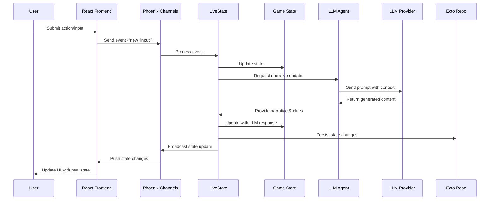
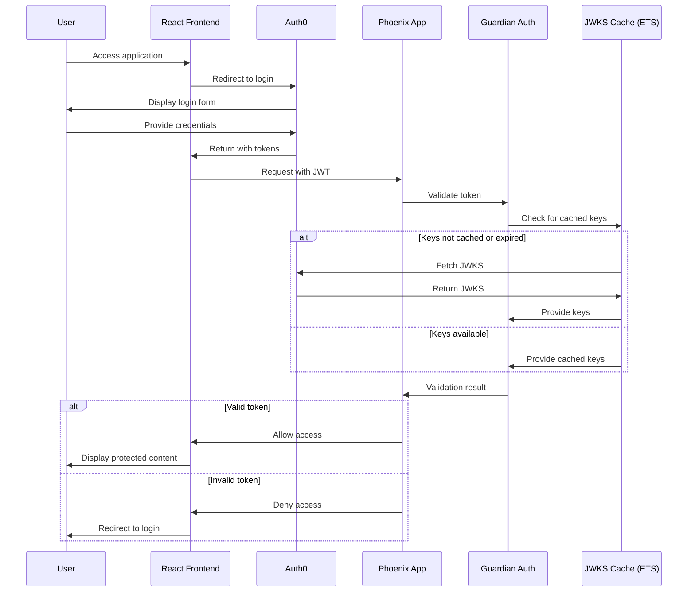
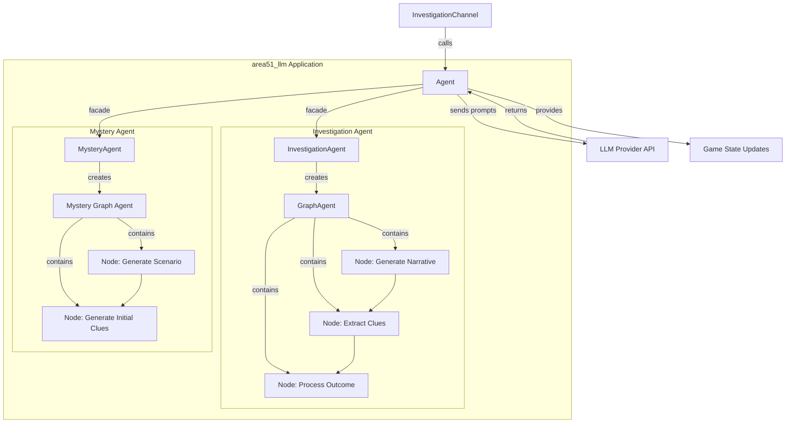
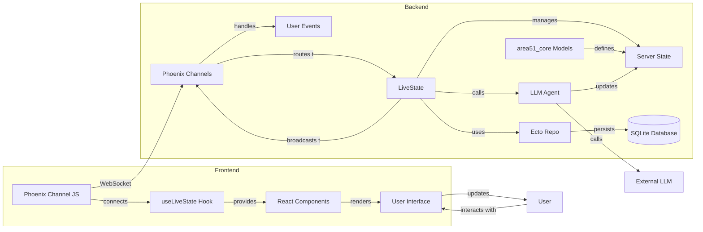

# Area 51 Architecture Diagrams

## State Management Flow

```mermaid
sequenceDiagram
    participant User
    participant ReactFrontend as React Frontend
    participant PhoenixChannels as Phoenix Channels
    participant LiveState
    participant GameState as Game State
    participant LLMAgent as LLM Agent
    participant LLMProvider as LLM Provider
    participant EctoRepo as Ecto Repo

    User->>ReactFrontend: Submit action/input
    ReactFrontend->>PhoenixChannels: Send event ("new_input")
    PhoenixChannels->>LiveState: Process event
    LiveState->>GameState: Update state
    LiveState->>LLMAgent: Request narrative update
    LLMAgent->>LLMProvider: Send prompt with context
    LLMProvider->>LLMAgent: Return generated content
    LLMAgent->>LiveState: Provide narrative & clues
    LiveState->>GameState: Update with LLM response
    LiveState->>EctoRepo: Persist state changes
    LiveState->>PhoenixChannels: Broadcast state update
    PhoenixChannels->>ReactFrontend: Push state changes
    ReactFrontend->>User: Update UI with new state
```

## Authentication Flow

```mermaid
sequenceDiagram
    participant User
    participant ReactFrontend as React Frontend
    participant Auth0
    participant PhoenixApp as Phoenix App
    participant GuardianAuth as Guardian Auth
    participant JWKSCache as JWKS Cache (ETS)

    User->>ReactFrontend: Access application
    ReactFrontend->>Auth0: Redirect to login
    Auth0->>User: Display login form
    User->>Auth0: Provide credentials
    Auth0->>ReactFrontend: Return with tokens
    ReactFrontend->>PhoenixApp: Request with JWT
    PhoenixApp->>GuardianAuth: Validate token
    GuardianAuth->>JWKSCache: Check for cached keys
    alt Keys not cached or expired
        JWKSCache->>Auth0: Fetch JWKS
        Auth0->>JWKSCache: Return JWKS
        JWKSCache->>GuardianAuth: Provide keys
    else Keys available
        JWKSCache->>GuardianAuth: Provide cached keys
    end
    GuardianAuth->>PhoenixApp: Validation result
    alt Valid token
        PhoenixApp->>ReactFrontend: Allow access
        ReactFrontend->>User: Display protected content
    else Invalid token
        PhoenixApp->>ReactFrontend: Deny access
        ReactFrontend->>User: Redirect to login
    end
```

## LLM Integration Architecture

```mermaid
graph TD
    subgraph "area51_llm Application"
        Agent--facade-->InvestigationAgent
        Agent--facade-->MysteryAgent

        subgraph "Investigation Agent"
            InvestigationAgent--creates-->GraphAgent
            GraphAgent--contains-->GenerateNarrative["Node: Generate Narrative"]
            GraphAgent--contains-->ExtractClues["Node: Extract Clues"]
            GraphAgent--contains-->ProcessOutcome["Node: Process Outcome"]
            GenerateNarrative-->ExtractClues-->ProcessOutcome
        end

        subgraph "Mystery Agent"
            MysteryAgent--creates-->MysteryGraph["Mystery Graph Agent"]
            MysteryGraph--contains-->GenerateScenario["Node: Generate Scenario"]
            MysteryGraph--contains-->GenerateClues["Node: Generate Initial Clues"]
            GenerateScenario-->GenerateClues
        end
    end

    InvestigationChannel--calls-->Agent
    Agent--sends prompts-->LLMProvider["LLM Provider API"]
    LLMProvider--returns-->Agent
    Agent--provides-->GameState["Game State Updates"]
```

## Component Interaction Model

```mermaid
graph LR
    subgraph "Frontend"
        RC["React Components"]--renders-->UI["User Interface"]
        LSH["useLiveState Hook"]--provides-->RC
        PCJ["Phoenix Channel JS"]--connects-->LSH
    end

    subgraph "Backend"
        PC["Phoenix Channels"]--handles-->Events["User Events"]
        LS["LiveState"]--manages-->State["Server State"]
        PC--routes to-->LS
        LS--broadcasts to-->PC
        LS--calls-->LLMA["LLM Agent"]
        Core["area51_core Models"]--defines-->State
        LLMA--updates-->State
        LS--uses-->Repo["Ecto Repo"]
        Repo--persists-->DB[("SQLite Database")]
    end

    PCJ--WebSocket-->PC
    User--interacts with-->UI
    UI--updates-->User
    LLMA--calls-->LLM["External LLM"]
```
